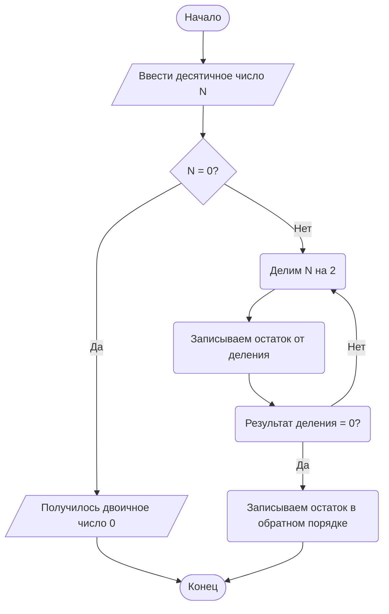

# Блок-схема алгоритма перевода числа из десятичной системы в двоичную

**Описание алгоритма:**  
Алгоритм принимает на вход целое десятичное число `N` и переводит его в двоичную систему счисления.  
Для этого число последовательно делится на 2, а остатки от деления записываются. После завершения деления остатки располагаются в обратном порядке, образуя двоичную запись исходного числа. Если введено число 0, результат сразу равен 0.

## Блок-схема

## Ответы на контрольные вопросы

**1. Что такое Mermaid и для чего он используется?**  
Mermaid — это язык разметки для создания диаграмм и схем в текстовом виде. Он используется для построения блок-схем, диаграмм последовательности, диаграмм классов, ER-диаграмм, диаграмм Ганта и других схем прямо внутри Markdown-документов.

**2. Как вставить диаграмму в Markdown-документ?**  
Диаграмма вставляется в Markdown через блок кода с указанием языка `mermaid`.

**3. Какие типы узлов (фигур) доступны в блок-схемах Mermaid?**  
В Mermaid доступны прямоугольники для процессов, ромбы для условий, овалы или скруглённые блоки для начала и конца, параллелограммы для ввода и вывода, цилиндры для данных и круги для соединителей.

**4. Чем отличаются стрелки `-->` и `-- текст -->`?**  
Стрелка `-->` показывает обычную связь между узлами без подписи, а `-- текст -->` добавляет подпись на стрелку, например «Да» или «Нет».

**5. Как изменить ориентацию диаграммы с вертикальной на горизонтальную?**  
Нужно изменить направление диаграммы. Например, вместо `flowchart TD` использовать `flowchart LR`, где `LR` означает направление слева направо.

**6. Зачем нужны подграфы (`subgraph`)?**  
Подграфы нужны для группировки связанных узлов внутри большой схемы. Они помогают визуально разделить алгоритм на логические части и сделать диаграмму более понятной.

**7. Какие символы нельзя использовать в идентификаторах узлов?**  
В идентификаторах узлов нельзя использовать пробелы и специальные символы, которые могут нарушить синтаксис Mermaid. Лучше использовать латинские буквы, цифры и понятные имена без пробелов.

**8. Почему важно указывать начальный и конечный узлы?**  
Начальный и конечный узлы показывают, где алгоритм начинается и где завершается. Это делает блок-схему логически завершённой и облегчает понимание последовательности действий.
