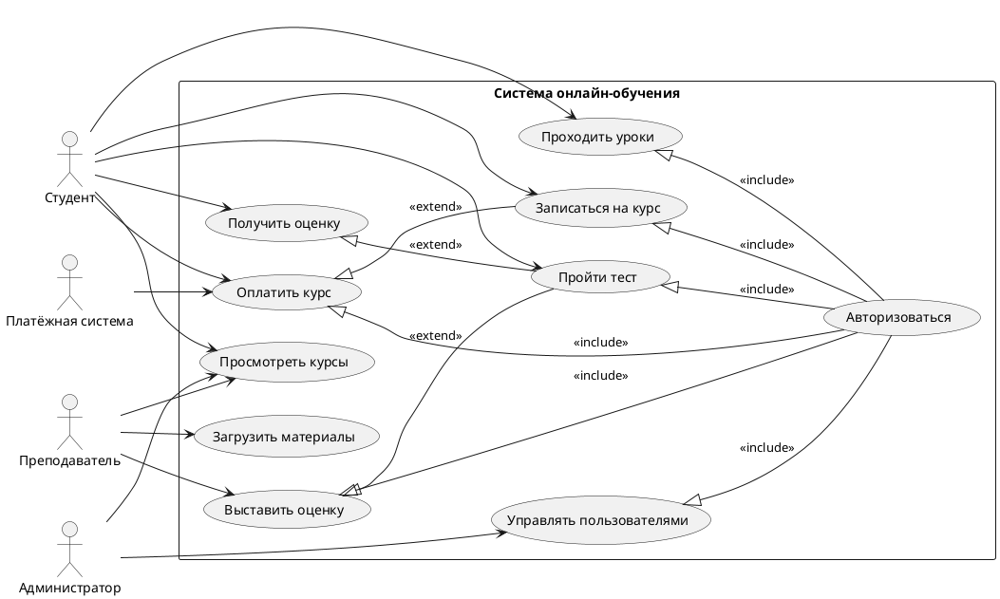

# Диаграмма прецедентов: Система онлайн-обучения

## Описание предметной области

Система онлайн-обучения предназначена для организации учебного процесса в электронной среде.  
Она позволяет студентам просматривать курсы, записываться на обучение, проходить уроки и тесты, а также получать оценки.  
Преподаватели могут загружать учебные материалы и выставлять оценки, а администратор управляет пользователями системы.  
Также система взаимодействует с внешней платёжной системой для оплаты платных курсов.

## Файл диаграммы

Основная диаграмма выполнена в файле `usecase_Сусло_Антон.puml` с использованием синтаксиса PlantUML.

## Акторы

- **Студент** — пользователь, который проходит обучение в системе.
- **Преподаватель** — пользователь, который создаёт и сопровождает учебные материалы, проверяет результаты студентов.
- **Администратор** — пользователь, который управляет пользователями и настройками системы.
- **Платёжная система** — внешняя система, которая участвует в обработке оплаты курсов.

## Прецеденты

- **Просмотреть курсы** — просмотр списка доступных учебных курсов.
- **Записаться на курс** — оформление участия студента в выбранном курсе.
- **Оплатить курс** — выполнение оплаты за платный курс.
- **Проходить уроки** — изучение учебных материалов курса.
- **Пройти тест** — выполнение проверочного задания или тестирования.
- **Получить оценку** — получение результата после прохождения теста.
- **Загрузить материалы** — добавление преподавателем учебных материалов.
- **Выставить оценку** — фиксация результата работы студента.
- **Управлять пользователями** — добавление, удаление или изменение данных пользователей.
- **Авторизоваться** — вход пользователя в систему перед выполнением защищённых действий.

## Отношения

- **Ассоциации** связывают акторов с теми прецедентами, которые они выполняют.
- **include** используется для прецедента **Авторизоваться**, так как запись на курс, оплата, прохождение уроков, тестов, выставление оценок и управление пользователями требуют предварительного входа в систему.
- **extend** используется для прецедента **Оплатить курс**, так как оплата нужна не всегда, а только для платных курсов.
- **extend** также используется для прецедентов **Получить оценку** и **Выставить оценку**, так как они являются дополнительными действиями после прохождения теста.

## Код диаграммы PlantUML

## Ответы на контрольные вопросы

**1. Что такое диаграмма прецедентов и для чего она используется?**  
Диаграмма прецедентов — это UML-диаграмма, которая показывает, какие функции предоставляет система и какие внешние участники с ними взаимодействуют. Она используется для описания функциональных требований к системе.

**2. Чем актор отличается от прецедента?**  
Актор — это внешняя роль или система, которая взаимодействует с разрабатываемой системой. Прецедент — это функция или возможность, которую система предоставляет актору.

**3. Что обозначает системная граница?**  
Системная граница показывает, какие функции относятся к самой системе, а какие участники находятся вне неё. На диаграмме она обычно изображается прямоугольником с названием системы.

**4. В чём разница между отношениями include и extend?**  
`include` означает обязательное включение одного прецедента в другой.  
`extend` означает дополнительное поведение, которое выполняется только при определённых условиях.

**5. Почему Mermaid не подходит для построения полноценных use case диаграмм?**  
Mermaid не поддерживает полноценный синтаксис use case диаграмм UML, включая корректные акторы, прецеденты и отношения `include`/`extend`. Поэтому для таких диаграмм лучше использовать PlantUML.

**6. Какой синтаксис PlantUML используется для определения актора и прецедента?**  
Для актора используется синтаксис `actor "Название" as alias`.  
Для прецедента используется синтаксис `usecase "Название" as alias`.

**7. Как в PlantUML задать отношение include?**  
Отношение include можно задать направленной связью с подписью `<<include>>`. В данной работе используется форма:  
`EnrollCourse <|-- Auth : <<include>>`

**8. Какие правила именования акторов и прецедентов вы знаете?**  
Акторы называются существительными, отражающими их роль в системе, например «Студент» или «Администратор».  
Прецеденты называются глаголами с существительными, например «Просмотреть курсы», «Оплатить курс», «Выставить оценку».
