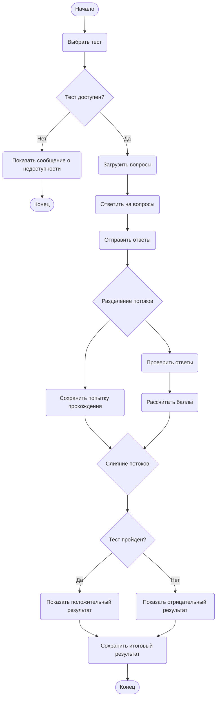

# Диаграмма деятельности: Процесс прохождения теста в системе онлайн-обучения

## Описание процесса

Диаграмма описывает процесс прохождения теста студентом в системе онлайн-обучения.  
Студент выбирает тест, система проверяет доступность теста, после чего студент отвечает на вопросы. После отправки ответов система параллельно проверяет ответы и сохраняет результат. Затем студенту выводится итоговая оценка. Если тест недоступен, система сообщает об ошибке и завершает процесс.

## Диаграмма

## Пояснение к диаграмме

- **Начальный узел** показывает старт процесса прохождения теста.
- **Действия** отражают основные шаги: выбор теста, загрузка вопросов, ввод ответов, отправка ответов, проверка и сохранение результата.
- **Узел решения** `Тест доступен?` делит процесс на успешный сценарий и сценарий отказа.
- **Параллельная ветвь** начинается после отправки ответов: система одновременно проверяет ответы и сохраняет попытку прохождения.
- **Узел слияния** объединяет параллельные потоки перед проверкой результата.
- **Узел решения** `Тест пройден?` определяет, какой результат будет показан студенту.
- **Конечные узлы** завершают процесс при недоступности теста или после сохранения итогового результата.

## Ответы на контрольные вопросы

**1. Что такое диаграмма деятельности и для чего она используется?**  
Диаграмма деятельности — это UML-диаграмма, которая показывает последовательность действий в процессе, условия переходов, ветвления и параллельные потоки. Она используется для описания бизнес-процессов, алгоритмов и сценариев работы системы.

**2. Чем диаграмма деятельности отличается от блок-схемы?**  
Блок-схема обычно показывает алгоритм как последовательность шагов и условий. Диаграмма деятельности шире по смыслу: она может отображать параллельные потоки, синхронизацию, распределение ответственности и более сложные бизнес-процессы.

**3. Как обозначается начальный узел в Mermaid?**  
В Mermaid начальный узел можно обозначить скруглённым блоком, например `Start([Начало])`. Также в некоторых вариантах используется обозначение `([*])`.

**4. Как обозначается узел решения (ветвление)?**  
Узел решения обозначается ромбом с помощью фигурных скобок, например `Check{Условие?}`.

**5. Как в Mermaid реализовать параллельные ветви (fork/join)?**  
В Mermaid параллельные ветви можно смоделировать через узел-разделитель, от которого выходят несколько стрелок к разным действиям, а затем эти ветви сходятся в общий узел соединения.

**6. Зачем нужны узлы слияния (merge) и соединители (join)?**  
Узел слияния объединяет альтернативные ветви после условия. Соединитель join синхронизирует параллельные потоки и продолжает выполнение только после завершения всех необходимых действий.

**7. Какие правила именования действий вы знаете?**  
Действия лучше называть глаголами или глагольными фразами: «Выбрать тест», «Проверить ответы», «Сохранить результат». Название должно быть кратким и отражать выполняемую операцию.

**8. Можно ли на одной диаграмме деятельности иметь несколько конечных узлов?**  
Да, можно. Несколько конечных узлов используются, если процесс может завершаться разными сценариями, например успешным завершением или ошибкой.
