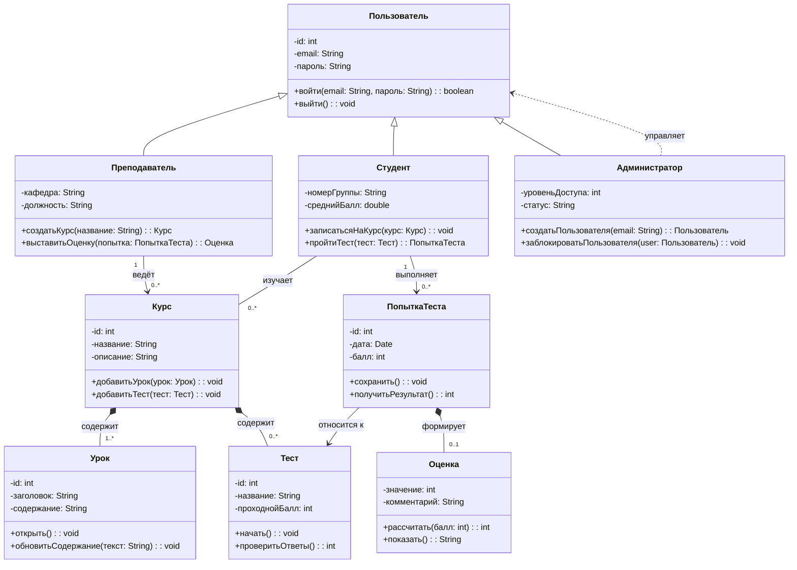

# Диаграмма классов: Система онлайн-обучения

## Описание предметной области

Диаграмма классов разработана для предметной области **«Система онлайн-обучения»**, которая использовалась в практической работе №14.  
Система позволяет студентам проходить курсы, изучать уроки, выполнять тесты и получать оценки. Преподаватели создают и ведут курсы, добавляют уроки и тесты. Администратор управляет пользователями системы.

## Основные классы

- **Пользователь** — базовый класс для всех пользователей системы.
- **Студент** — пользователь, который записывается на курсы, проходит уроки и тесты.
- **Преподаватель** — пользователь, который создаёт курсы и выставляет оценки.
- **Администратор** — пользователь, который управляет учётными записями.
- **Курс** — учебный курс, содержащий уроки и тесты.
- **Урок** — отдельный учебный материал внутри курса.
- **Тест** — проверочное задание по курсу.
- **ПопыткаТеста** — результат прохождения теста студентом.
- **Оценка** — итоговая оценка за выполненный тест.

## Диаграмма

## Пояснение к отношениям

- **Наследование:** классы `Студент`, `Преподаватель` и `Администратор` наследуются от базового класса `Пользователь`, потому что все они имеют общие данные входа в систему.
- **Композиция:** `Курс` содержит `Урок` и `Тест`. В рамках данной модели уроки и тесты существуют как составные части курса.
- **Ассоциация:** `Студент` связан с курсами, которые он изучает, а `Преподаватель` связан с курсами, которые он ведёт.
- **Композиция:** `ПопыткаТеста` формирует `Оценка`, так как оценка появляется как результат конкретной попытки прохождения теста.
- **Зависимость:** `Администратор` зависит от класса `Пользователь`, поскольку выполняет операции управления пользователями.

## Ответы на контрольные вопросы

**1. Что такое диаграмма классов и для чего она используется?**  
Диаграмма классов — это UML-диаграмма, которая показывает статическую структуру системы: классы, их атрибуты, методы и связи между ними. Она используется для проектирования архитектуры программы и документирования объектной модели.

**2. Какие три основные секции имеет прямоугольник класса?**  
Прямоугольник класса обычно состоит из трёх секций: имя класса, атрибуты класса и методы класса.

**3. Что означают символы `+`, `-`, `#` перед атрибутами и методами?**  
`+` означает public — открытый доступ. `-` означает private — закрытый доступ. `#` означает protected — защищённый доступ.

**4. Как в Mermaid обозначается наследование?**  
Наследование в Mermaid обозначается стрелкой `--|>`, например: `Студент --|> Пользователь`.

**5. В чём разница между агрегацией и композицией?**  
Агрегация — это слабая связь «часть-целое», при которой часть может существовать отдельно от целого. Композиция — это сильная связь «часть-целое», при которой часть зависит от целого и обычно не существует без него.

**6. Как указать множественность отношения, например «один ко многим»?**  
Множественность указывается в кавычках рядом с концами связи, например: `Преподаватель "1" --> "0..*" Курс`.

**7. Как изобразить интерфейс в Mermaid?**  
Интерфейс можно изобразить как класс со стереотипом `<<interface>>` внутри описания класса.

**8. Какую информацию можно указать в сигнатуре метода?**  
В сигнатуре метода можно указать видимость, имя метода, параметры с типами и тип возвращаемого значения, например: `+создатьКурс(название: String): Курс`.
